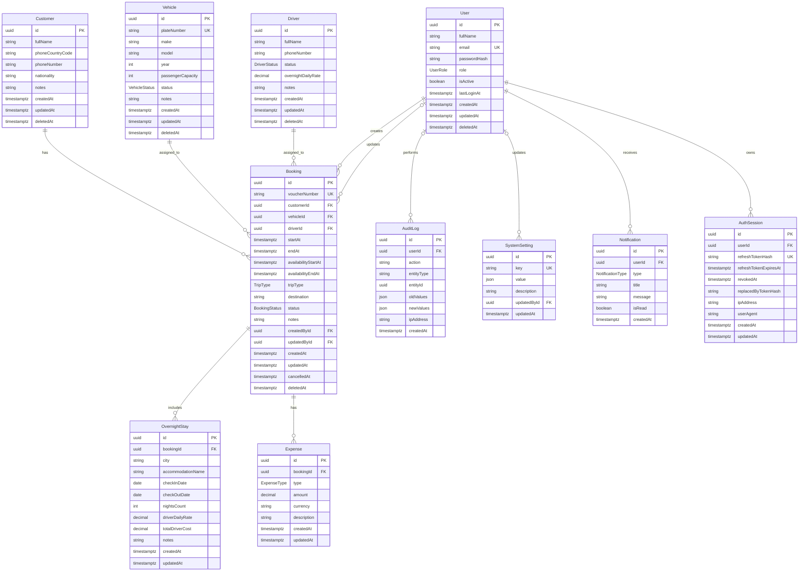

# Database Schema

## Overview

Phase 2 defines the normalized PostgreSQL schema for the planned Fleet and Booking Management System. Prisma Client, the initial migration, development seed data, and database validation scripts live in `apps/api/prisma`.

## Entities

- `User`
- `Vehicle`
- `Driver`
- `Customer`
- `Booking`
- `OvernightStay`
- `Expense`
- `AuditLog`
- `SystemSetting`
- `Notification`
- `AuthSession`

## Enums

### UserRole

- `ADMIN`
- `STAFF`

### BookingStatus

- `DRAFT`
- `CONFIRMED`
- `IN_PROGRESS`
- `COMPLETED`
- `CANCELLED`

### VehicleStatus

- `AVAILABLE`
- `BOOKED`
- `MAINTENANCE`
- `OUT_OF_SERVICE`
- `INACTIVE`

### DriverStatus

- `AVAILABLE`
- `ASSIGNED`
- `ON_LEAVE`
- `INACTIVE`

### Additional Enums

- `TripType`: `CITY`, `OUTSIDE_CITY`, `OVERNIGHT`
- `ExpenseType`: `FUEL`, `TOLL`, `PARKING`, `ACCOMMODATION`, `MEAL`, `MAINTENANCE`, `OTHER`
- `NotificationType`: `SYSTEM`, `BOOKING`, `VEHICLE`, `DRIVER`, `REPORT`

## Mermaid ERD

## Indexes

The schema includes indexes for:

- Booking dates.
- Booking availability blocking dates.
- Booking `vehicleId`, `driverId`, `customerId`, `status`, and `voucherNumber`.
- Compound booking indexes for future vehicle/driver conflict checks.
- Vehicle `plateNumber` and `status`.
- Soft deletion fields on core business entities.

## Constraints

- `User.email` is unique.
- `Vehicle.plateNumber` is unique.
- `Booking.voucherNumber` is unique.
- `Booking.endAt` must be later than `Booking.startAt`.
- Phase 6 adds PostgreSQL `btree_gist` and exclusion constraints on `Booking` to prevent overlapping active bookings for the same `vehicleId` or `driverId`.
- Phase 7 moves those overlap constraints to the stored `availabilityStartAt` and `availabilityEndAt` range so overnight pre/post buffers block resources.
- The overlap constraints use `tstzrange("availabilityStartAt", "availabilityEndAt", '[)')`, so bookings that touch exactly at the boundary do not conflict.
- The overlap constraints apply only when `deletedAt IS NULL` and `status <> 'CANCELLED'`.
- `Booking.availabilityEndAt` must be later than `Booking.availabilityStartAt`.
- Monetary fields are decimal and must be non-negative.
- Vehicle capacity must be positive.
- Overnight stay checkout date must be later than check-in date.

## Phase 7 Migration

Migration `202607190002_phase_7_overnight_blocking_window` adds persisted availability windows to bookings, backfills existing records from `startAt` and `endAt`, and recreates the PostgreSQL exclusion constraints over the availability window.
